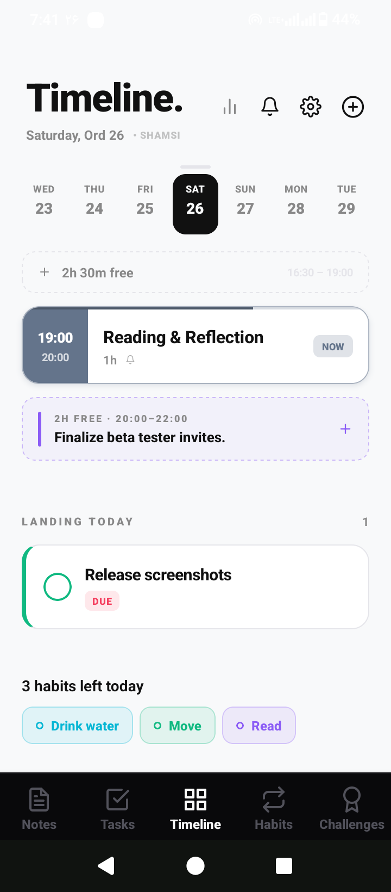
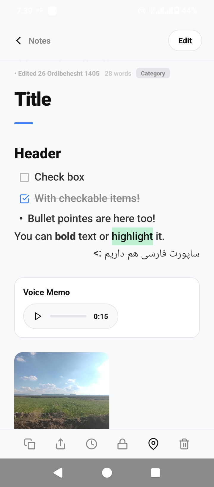
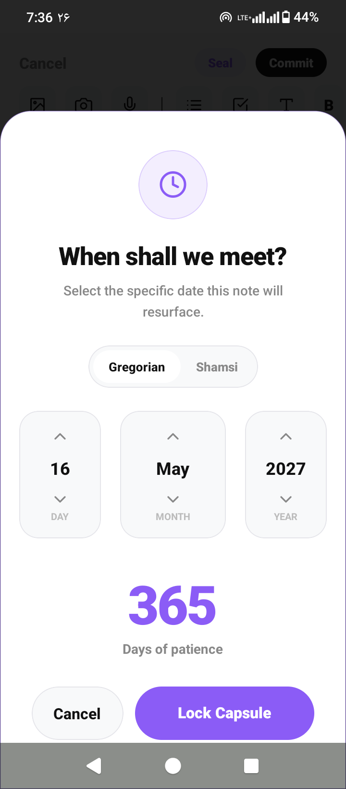
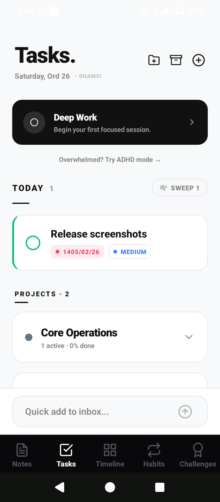
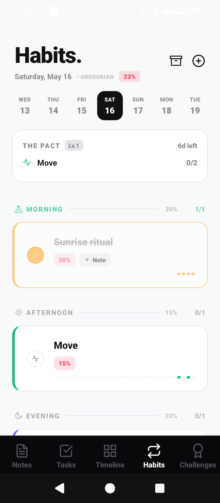
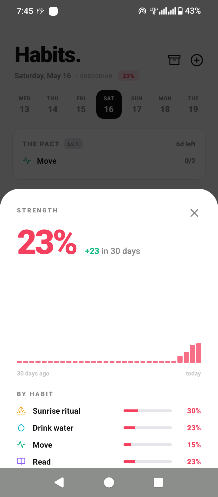
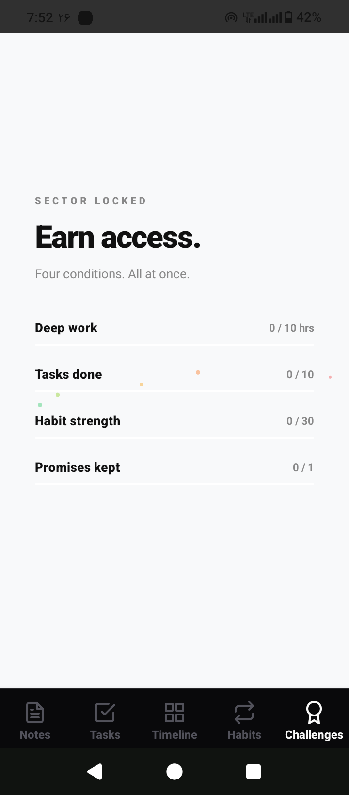

# Day-Progress

> **Working title.** A cross-platform mobile productivity app that combines habits, tasks, notes, a daily timeline, and milestone challenges into a single integrated workflow - built with React Native, Expo, and TypeScript.

> **Status:** Beta - actively developing.

## What This App Is

Most productivity apps focus on one thing. A habit tracker. A todo list. A note-taker. A goal-setter. Switching between them costs friction, and they never share context - your tasks don't know about your habits, your habits don't know about your goals.

Day-Progress puts all of them under one roof, with a shared data layer so they actually talk to each other. Your challenges unlock based on your habit strength. Your tasks have a commitment ritual ("Promise") that leaves a permanent mark when broken. Your timeline knows what you're doing right now. Your notes can be locked, sealed for later, or attached to anything else.

The app is built for **English and Persian (Farsi)** with full RTL handling. Both Gregorian and Shamsi (Persian) calendar systems are supported throughout.

## The Five Tabs

### 🗓️ Timeline (Command Center)
The default tab and the structural anchor of the app. Shows your day on a vertical day-spine where intent-based scheduling, habits, tasks, and focused work all flow into one view.

- **Intent-based scheduling** - define what tomorrow is about.
- **Note** - write something on any day you want, present or future. Useful for things you don't want to miss, like birthdays.
- **Pulse** - live activity indicator showing where you are in your scheduled day, week, month and year.
- **Weekly schedule** - recurring time blocks that auto-populate the daily view.
- **One-time schedule** - single-event entries that don't repeat.
- **Habits-left and due-tasks rollup** - the day's remaining habits and overdue tasks surface inline, so the Timeline always shows what's left.
- **Smart suggestions** - proposes tasks matched to your current energy level (via energy tags from the Tasks tab).
- **Focused block** - protected time where the Timeline stops suggesting and just runs the block.
- **Now-playing notifications** - real-time alerts that tell you what you should be doing.
- **Reminders** - scheduled time-based alerts.
- **Daily review** - end-of-day reflection prompt.
- **Weekly review** - recurring weekly retrospective.
- **Selective backup/restore** - export individual tabs' data rather than everything at once. Carries the schema-migration logic that handles AsyncStorage → MMKV upgrades cleanly.

### 📝 Notes
A note-taking surface that goes well past plain text:
- **Markdown formatting** with inline text highlighting.
- **Audio memos** - record voice notes inline with text and images.
- **Image attachments** with a zoomable viewer.
- **Biometric locks** - protect individual notes with Face ID / fingerprint.
- **Sealed notes (time capsules)** - write something today that unlocks at a future date you set.
- **Snapshot history** - every note keeps a timeline of past versions.
- **Templates** for repeatable note structures.
- **Tags** for cross-note organization and filtering.
- **Search** across all notes.
- **Markdown export** - share notes as `.md` files.
- **Capsule notifications** - sealed-note unlock reminders.
- **Diary view** as a separate visual mode for chronological writing.
- Full RTL / Persian support with proper text-direction detection per line.

### ✅ Tasks
A project + task system, not a flat to-do list:
- **Projects** group related tasks with their own color and status.
- **Sub-tasks**, **priority** (Low / Medium / High), and per-task **description**.
- **Start-time and deadline pickers** - distinct from each other, supporting time-blocked work, not just due dates.
- **Urgency levels** that escalate as the deadline approaches (`none` → `low` → `medium` → `high` → `critical` → `overdue`).
- **Recurrence** - daily, weekly, monthly, or custom day-of-month / day-of-week patterns.
- **Quick add** for low-friction task entry.
- **Deep Work sessions** linked to "intents" - focused-work scaffolding distinct from tasks.
- **Reminders** with custom offset days and per-task notifications.
- **ADHD mode** - a low-distraction view that strips visual noise and surfaces one thing at a time.
- **Overgrowth** *(under construction)* - a secret for now.
- **The Promise system** - an opt-in commitment ritual. Promising a task makes it carry a colored accent stripe and counts toward a monthly Kept/Broken tally. **If a promised task hits its deadline uncompleted, the "scar" is permanent** - completing or archiving it afterward never clears the broken-promise marker. The pain is intentional and the data model enforces it.

### 🔁 Habits
A habit tracker built around a **Strength Score** - a single 0-100 number per habit that's the source of truth for the whole tab:

| Event | Effect |
|---|---|
| Completion | **+5** (or **+7.5** if score < 50 - hidden comeback bonus) |
| Miss / skip | −8 |
| Rest day 1 in a row | 0 (rest is free) |
| Rest days 2 → 5+ in a row | −2, −4, −6, **−8** (rest becomes equivalent to running away) |

Plus:
- **Daily target** - quantitative or duration-based completion threshold per habit.
- **Streak** counter alongside Strength Score (consecutive completion days).
- **Time blocks** (morning / afternoon / evening / anytime).
- **Schedule types** - specific weekdays *or* interval-based ("every 3 days").
- **Rest days**, **skipped days**, and **per-day completion notes**.
- **"Day Conquered" celebration variations** - five distinct visual treatments (`Eclipse_Silence`, `Eclipse_Brutal`, `Eclipse_Hour`, `Eclipse_Horizon`, `Eclipse_NightSky`), randomly selected so the reward never goes stale.
- **Reminders** via `@notifee/react-native`.
- **Pact** - a commitment ritual for habits, analogous to the Promise system in Tasks but less punishing.

### 🏆 Challenges
Multi-stage goal tracking with progression mechanics:
- **Milestones** within each challenge.
- **Achievements** unlocked across the system.
- **Urgency styles** - challenges visually transform as their deadline closes in. Two thresholds:
  - **STATIC** (≤7 days) - ambient amber imperfection.
  - **HAEMORRHAGE** (≤3 days) - red alarm state.
- **Narrator tones** - different voices for the same challenge based on user preference.
- **Dead states** - graceful handling of failed challenges (the app doesn't pretend it didn't happen).
- **Preset library** of pre-built challenges to start from.
- **Finishing-line message** - a custom message attached to each challenge, revealed at completion.
- **Unlock gate** - the Challenges tab is gated behind a minimum global habit-strength score, so users can't grab the gamification reward without building a baseline first.

## Engineering Highlights

A few things worth pointing out for anyone reviewing the code:

- **Schema migration logic** - when the storage layer moved from AsyncStorage to MMKV (v20 → v21), the Timeline tab reads legacy keys on first focus, writes them to the new store, then deletes the old keys with a one-time `MIGRATION_DONE_KEY`. Real production-grade migration handling.
- **Comments document non-obvious choices.** Why `KeyboardAvoidingView` from `react-native-keyboard-controller` instead of the built-in or `KeyboardAwareScrollView`? There's a multi-line comment in `app/(tabs)/index.tsx` explaining the double-lift bug that decision avoids.
- **Single-source-of-truth scoring.** `lib/habitScore.ts` exists because the Challenges tab needs to know habit strength without importing the Habits tab. Pulled out specifically to keep heavy UI imports off other tabs.
- **Persian / RTL is first-class**, not bolted on. `lib/rtl.ts` provides direction detection and styling helpers used across every tab. Lines auto-detect their direction so mixed-language notes work correctly.
- **Calendar abstraction** - the entire app stores dates as ISO strings but UI accepts both Gregorian and Shamsi (Persian) calendar systems via a `CalendarSystem` type used throughout the store.

## Tech Stack

- **React Native 0.81** + **Expo SDK 54** with file-based routing (`expo-router`)
- **TypeScript** (strict)
- **Zustand** with `persist` middleware - central state in `store/useAppStore.ts`
- **react-native-mmkv** - fast, synchronous key-value storage
- **@notifee/react-native** + **expo-notifications** - local + scheduled notifications
- **@gorhom/bottom-sheet** - sheets for quick-add / settings UI
- **@shopify/flash-list** - virtualized lists for performance
- **react-native-reanimated** + **react-native-gesture-handler** + **react-native-skia** - animation and graphics
- **victory-native** + **react-native-chart-kit** - charts and stats
- **react-native-keyboard-controller** - cross-platform keyboard handling
- **expo-local-authentication** - biometric note locks
- **expo-av** + **expo-image-picker** - audio memos and image attachments
- **react-native-iap** - in-app purchase scaffolding (future monetization)
- **jszip** - packaged backup exports

## Project Structure

```
day-progress/
├── app/                    # expo-router screens
│   └── (tabs)/             # the five-tab bottom navigator
│       ├── _layout.tsx     # tab bar definition
│       ├── index.tsx       # Timeline (default route)
│       ├── notes.tsx
│       ├── todo.tsx
│       ├── habits.tsx
│       ├── challenges.tsx
│       └── art.tsx         # dev-only visual sandbox (__DEV__ gated)
├── components/
│   ├── timeline/           # Timeline subcomponents (DaySpine, modals, etc.)
│   ├── challenges/         # Challenge UI (preset picker, etc.)
│   ├── notes/              # Notes UI (DiaryView, AudioPlayer)
│   ├── ui/                 # shared UI primitives
│   ├── DayConqueredVariations.tsx  # 5 Eclipse celebration variants
│   └── CalendarPicker.tsx          # Gregorian + Shamsi date picker
├── lib/
│   ├── backup.ts                # selective tab/slice backup + restore
│   ├── habitScore.ts            # single-source-of-truth scoring
│   ├── challengePresets.ts      # built-in challenge templates
│   ├── notesExport.ts           # markdown export
│   ├── notesRichText.ts         # markdown stripping, line-direction
│   ├── rtl.ts                   # RTL detection + style helpers
│   ├── notifChannels.ts         # Android notification channel IDs
│   ├── reminderNotifications.ts # task reminders
│   ├── timelineNotifications.ts # "now playing" timeline alerts
│   └── timelineTheme.ts         # color system
├── store/
│   └── useAppStore.ts      # Zustand store - all persisted state
├── hooks/                  # theme + color-scheme hooks
├── constants/              # shared constants
├── assets/                 # fonts, images, icons
├── scripts/                # build / reset helpers
└── wake-plugin.js          # custom Expo config plugin
```

## Running Locally

```bash
npm install
npx expo start
```

Because the app uses native modules (notifee, MMKV, Skia, biometric auth, etc.), **Expo Go is not sufficient** - you'll need a development build:

```bash
npx expo run:android   # or run:ios
```

## Screenshots

### 🗓️ Timeline
<p align="center">
  
</p>

### 📝 Notes
| Note view | Sealing a note |
|---|---|
|  |  |

### ✅ Tasks
<p align="center">
  
</p>

### 🔁 Habits
| Habits view | Strength Score system |
|---|---|
|  |  |

### 🏆 Challenges
<p align="center">
  
</p>

## Author

Hamed Nasrabadi - Statistics student at the University of Tehran.
