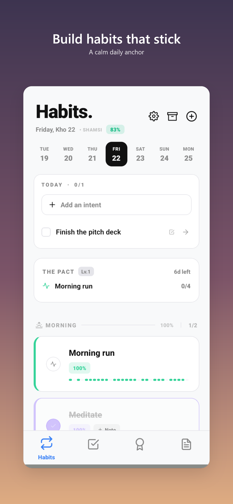
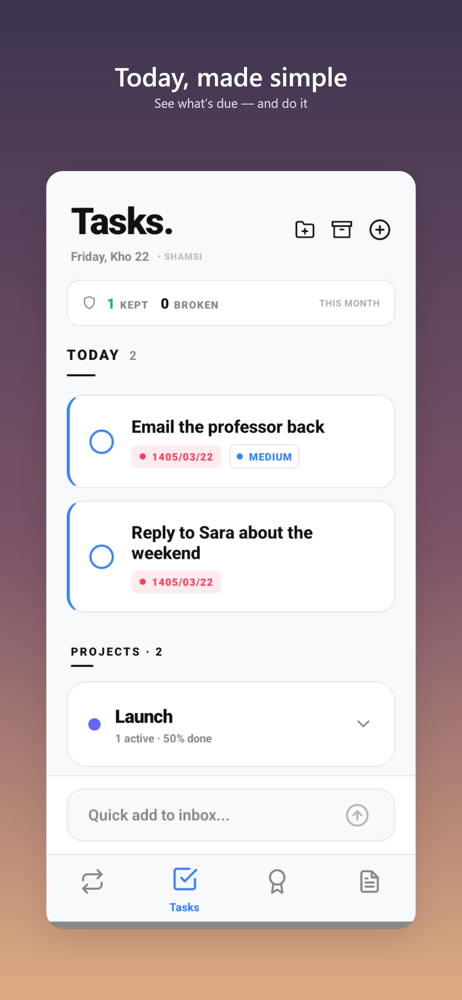
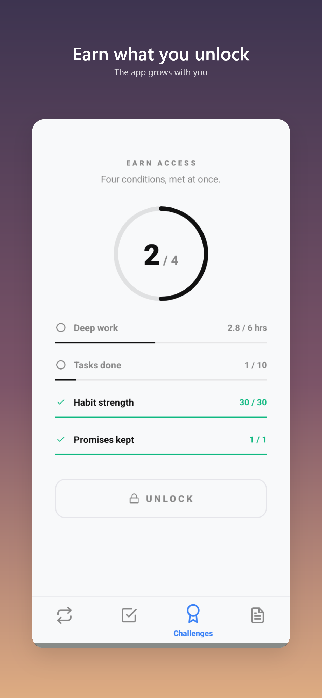
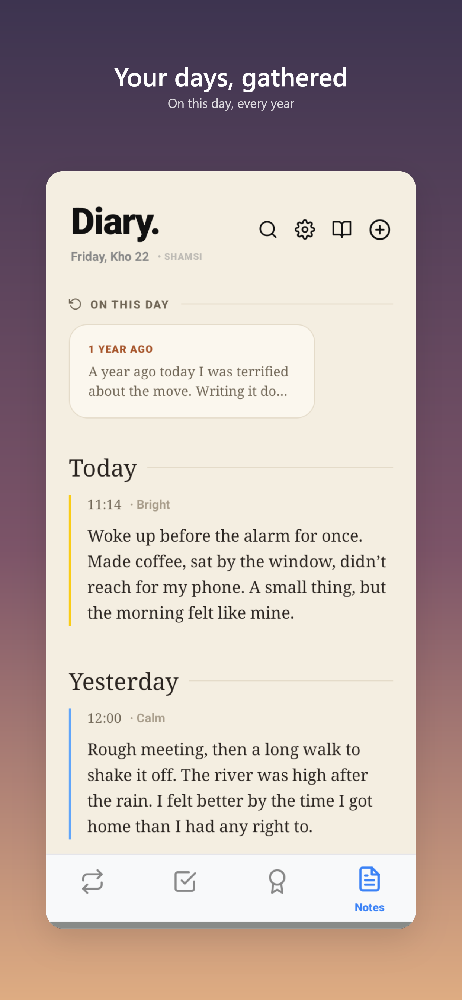

# Dawn

> A cross-platform mobile productivity app that brings habits, tasks, notes, and milestone challenges into a single integrated workflow - built with React Native, Expo, and TypeScript. Named for the hook at its core: every day is a fresh start. *(Formerly "Day-Progress" - the repo name and internal storage keys keep the old slug.)*

> **Status:** Beta - actively developing.
>
> **Offline-first.** The current build runs entirely on-device. No backend, no network calls. Online sync, multi-device support, and a web companion are on the roadmap for a later release.

## Try it (Android)

Download the latest APK from [Releases](../../releases). Install and run, no dev setup needed.

You'll need to allow installation from unknown sources on your device the first time. An iOS build is not yet available.

## What This App Is

Most productivity apps focus on one thing. A habit tracker. A todo list. A note-taker. A goal-setter. Switching between them costs friction, and they never share context - your tasks don't know about your habits, your habits don't know about your goals.

Dawn puts them under one roof, with a shared data layer so they actually talk to each other. Your challenges advance when you complete the habits linked to them. Your tasks carry a commitment ritual ("Promise") that leaves a permanent mark when broken. Your end-of-week reflection lands in your notes. **Habits is the home screen** - the calm anchor the app opens to - and everything else grows out from there.

The app also **reveals itself over time.** Rather than dropping every feature on a brand-new user, surfaces unlock as you actually use it (see [Progressive Unlock](#progressive-unlock)).

It's built for **English and Persian (Farsi)** with full RTL handling, and ships in **three themes** - Light, a softened graphite Dark, and a deep-navy Blue. Both Gregorian and Shamsi (Persian) calendar systems are supported throughout.

## The Four Tabs

The app opens on **Habits**, and the bar runs **Habits → Tasks → Challenges → Notes**.

### 🔁 Habits (home)
The anchor of the app, built around a **Strength Score** - a single 0-100 number per habit that's the source of truth for the whole tab:

| Event | Effect |
|---|---|
| Completion | **+5** (or **+7.5** comeback rate - only for a habit that has reached 50 and slipped back under) |
| Miss | **−6**, but the first miss each week is silently forgiven |
| Skip (deliberate) | **−6**, no weekly grace - a skip is a choice |
| Rest days in a row | 0 → −2 → −4 → **−6** (caps at a miss's cost; the rest-streak resets weekly, so the first rest of every week is free) |

Plus:
- **Daily target** - quantitative or duration-based completion threshold per habit.
- **Streak** counter alongside Strength Score (consecutive completion days).
- **Time blocks** (morning / afternoon / evening / anytime).
- **Schedule types** - specific weekdays *or* interval-based ("every 3 days").
- **Rest days**, **skipped days**, and **per-day completion notes**.
- **"Day Conquered" celebration** - distinct full-screen "Eclipse" treatments, randomly selected so the reward never goes stale.
- **The Pact** - a commitment ritual for habits, analogous to the Promise system in Tasks but less punishing.
- **Intent** - a "what is today for?" prompt above the day, so it starts with a direction.
- **Day rating** - an end-of-day "how did today go?" check-in that closes the day out.
- **Weekly Review** - at the end of your week a "close the week" prompt surfaces in-content for a 30-hour window (from 6pm on your chosen end-of-week day until the next day ends). The reflection you write is saved into the Notes tab.
- **Global settings live here** (the app's only settings surface): the **Light / Dark / Navy** theme picker, end-of-week day, and one-tap full backup / restore.
- **Reminders** via `@notifee/react-native`.

### ✅ Tasks
A project + task system, not a flat to-do list:
- **Projects** group related tasks with their own color and status.
- **Sub-tasks**, **priority** (Low / Medium / High), and per-task **description**.
- **Start-time and deadline pickers** - distinct from each other, supporting time-blocked work, not just due dates.
- **Urgency levels** that escalate as the deadline approaches (`none` → `low` → `medium` → `high` → `critical` → `overdue`).
- **Recurrence** - daily, weekly, monthly, or custom day-of-month / day-of-week patterns.
- **Quick add** for low-friction task entry.
- **Deep Work sessions** linked to "intents" - focused-work scaffolding distinct from tasks.
- **Reminders** with custom offset days and per-task notifications.
- **ADHD mode** - a low-distraction view that strips visual noise and surfaces one thing at a time.
- **Overgrowth** *(under construction)* - a secret for now.
- **The Promise system** - an opt-in commitment ritual. Promising a task makes it carry a colored accent stripe and counts toward a monthly Kept/Broken tally. **If a promised task hits its deadline uncompleted, the "scar" is permanent** - completing or archiving it afterward never clears the broken-promise marker. The pain is intentional and the data model enforces it.

### 🏆 Challenges
Multi-stage goal tracking with progression mechanics:
- **Cadence** - each challenge is *daily* (a chain that can break), *cumulative* (a total reached at any rate), or *one-shot* (do the thing once).
- **Habit links** - link habits to a challenge so completing them auto-advances its progress.
- **Ledger + chain** - a timestamped log of every increment, and a streak "chain" for daily challenges.
- **Milestones** within each challenge, and **achievements** unlocked across the system.
- **Urgency styles** - challenges visually transform as their deadline closes in. Two thresholds:
  - **STATIC** (≤7 days) - ambient amber imperfection.
  - **HAEMORRHAGE** (≤3 days) - red alarm state.
- **Narrator tones** - different voices for the same challenge based on user preference.
- **Dead states** - graceful handling of failed challenges (the app doesn't pretend it didn't happen).
- **Preset library** of pre-built challenges to start from.
- **Finishing-line message** - a custom message attached to each challenge, revealed at completion.
- **Unlock gate** - the Challenges tab is hidden for brand-new users and revealed by the progressive-unlock system after the first couple of days (a locked teaser appears first), so the gamification reward isn't handed over before there's a baseline to build on.

### 📝 Notes
A note-taking surface that goes well past plain text:
- **Markdown formatting** with inline text highlighting.
- **Audio memos** - record voice notes inline with text and images.
- **Image attachments** with a zoomable viewer.
- **Biometric locks** - gate individual notes behind Face ID / fingerprint. *(Honest scope: this is an in-app visibility gate - note content is not yet encrypted at rest. On-device encryption is on the roadmap.)*
- **Sealed notes (time capsules)** - write something today that unlocks at a future date you set. Exports hold still-sealed capsules back until their date, so the zip isn't a side door.
- **Snapshot history** - every note keeps a timeline of past versions.
- **Templates** for repeatable note structures.
- **Tags** for cross-note organization and filtering.
- **Search** across all notes.
- **Markdown export** - share notes as `.md` files.
- **Capsule notifications** - sealed-note unlock reminders.
- **Diary view** as a separate visual mode for chronological writing.
- **Weekly reviews** written on the Habits tab land here as notes.
- Full RTL / Persian support with proper text-direction detection per line.

## Progressive Unlock

Dawn doesn't hand a new user everything at once. Features reveal themselves as you use the app - a quiet "whisper" toast announces each unlock, a small dot marks what's new, and tabs like Challenges only appear once you've put in a few days. A first-launch intro sets the frame. Around day 30 a "depth map" lays out everything the app contains.

Under the hood it's a small data-driven engine (`lib/unlocks.ts` + `lib/unlockTriggers.ts`): unlock conditions are evaluated against primitive counters in the store via narrow Zustand selectors, so the root layout only re-renders when a counter actually crosses a threshold - gating lives in data, not hardcoded per screen.

## Engineering Highlights

A few things worth pointing out for anyone reviewing the code:

- **Versioned schema migrations.** The Zustand store carries a `migrate` function (currently **v9**) that reshapes persisted MMKV data across releases: renaming unlock keys, backfilling new challenge fields (cadence / links / ledger), stripping cut slices (Timeline, standalone reminders), and converting the old `isDarkMode` boolean into the 3-way `themeMode`. `npm run verify` guards it - plain-Node checks for the migration transform and the task-recurrence date math (month rollover, day-31 clamp, year wrap).
- **One theme system, three palettes.** `lib/timelineTheme.ts`'s `getTheme(themeMode)` is the single palette source; the React Navigation theme, the native window background, and every tab read from it, so a theme switch is coherent everywhere - and tab switches never flash the default white background.
- **Single-source-of-truth scoring.** `lib/habitScore.ts` exists because the Challenges tab needs habit strength without importing the Habits tab - pulled out specifically to keep heavy UI imports off other tabs.
- **Data-driven progressive unlock.** Feature gating is computed from store counters (`lib/unlocks.ts`), not branched per-screen, so adding a gate is a config change.
- **Comments document non-obvious choices.** Why `KeyboardAvoidingView` from `react-native-keyboard-controller` instead of the built-in? There's a comment explaining the double-lift bug that decision avoids.
- **Persian / RTL is first-class**, not bolted on. `lib/rtl.ts` provides direction detection and styling helpers used across every tab. Lines auto-detect their direction so mixed-language notes work correctly.
- **Calendar abstraction** - the entire app stores dates as ISO strings but UI accepts both Gregorian and Shamsi (Persian) calendar systems via a `CalendarSystem` type used throughout the store.

## Tech Stack

- **React Native 0.81** + **Expo SDK 54** with file-based routing (`expo-router`)
- **TypeScript** (strict)
- **Zustand** with `persist` middleware - central state in `store/useAppStore.ts`
- **react-native-mmkv** - fast, synchronous key-value storage
- **@notifee/react-native** + **expo-notifications** - local + scheduled notifications
- **@gorhom/bottom-sheet** - sheets for quick-add / settings UI
- **@shopify/flash-list** - virtualized lists for performance
- **react-native-reanimated** + **react-native-gesture-handler** - animation, gestures, and the custom animated tab bar
- **react-native-keyboard-controller** - cross-platform keyboard handling
- **expo-system-ui** - native root background color, kept in sync with the active theme
- **expo-local-authentication** - biometric note locks
- **expo-av** + **expo-image-picker** - audio memos and image attachments
- **react-native-iap** - in-app purchase scaffolding (future monetization)
- **jszip** - packaged backup exports

## Project Structure

```
day-progress/
├── app/                          # expo-router screens
│   ├── _layout.tsx               # root: nav theme, alarms, notifications, unlock triggers
│   └── (tabs)/                   # four-tab bottom navigator (custom AnimatedTabBar)
│       ├── _layout.tsx           # tab bar + screen options
│       ├── index.tsx             # redirect → habits (the anchor route)
│       ├── habits.tsx            # Habits - the home screen
│       ├── todo.tsx              # Tasks
│       ├── challenges.tsx        # Challenges
│       └── notes.tsx             # Notes
├── components/
│   ├── AnimatedTabBar.tsx            # custom animated footer
│   ├── SettingsSheet.tsx            # global settings (themes, end-of-week, backup)
│   ├── IntentPanel.tsx              # "what is today for?" (Habits)
│   ├── DayRatingCheckIn.tsx         # end-of-day rating (Habits)
│   ├── GrowthIntro.tsx              # first-launch progressive-unlock intro
│   ├── DepthMap.tsx                 # day-30 "depth map" of features
│   ├── Whisper.tsx                  # ambient unlock-announcement bar
│   ├── UnlockDot.tsx                # "new" dot for freshly unlocked features
│   ├── DayConqueredVariations.tsx   # "Eclipse" celebration variants
│   ├── CalendarPicker.tsx           # Gregorian + Shamsi date picker
│   ├── challenges/                  # Challenge UI (preset picker)
│   └── notes/                       # Notes UI (DiaryView, AudioPlayer, MarkdownContent)
├── lib/
│   ├── habitScore.ts                # single-source-of-truth habit scoring
│   ├── recurrence.ts                # task next-occurrence engine (Node-checked)
│   ├── capsule.ts                   # sealed-note unlock math (shared by UI + export)
│   ├── unlocks.ts                   # progressive-unlock engine (features, thresholds)
│   ├── unlockTriggers.ts            # evaluates unlock conditions from store counters
│   ├── weeklyReview.ts              # end-of-week review window logic
│   ├── challengeChain.ts            # challenge chain / streak logic
│   ├── challengeNotifications.ts    # challenge reminders
│   ├── challengePresets.ts          # built-in challenge templates
│   ├── backup.ts                    # full export / import
│   ├── notesExport.ts               # markdown export
│   ├── notesRichText.ts             # markdown stripping, line-direction
│   ├── rtl.ts                       # RTL detection + style helpers
│   ├── sanitize.ts                  # input sanitation
│   ├── notifChannels.ts             # Android notification channel IDs
│   └── timelineTheme.ts             # 3-mode color system (getTheme)
├── store/
│   └── useAppStore.ts            # Zustand store - all persisted state + migrations
├── scripts/                      # verify-persist-migration, verify-recurrence, find-unused-deps, etc.
├── assets/                       # fonts, images, icons
└── wake-plugin.js                # custom Expo config plugin
```

## Running Locally

```bash
npm install
npx expo start
```

Because the app uses native modules (notifee, MMKV, biometric auth, etc.), **Expo Go is not sufficient** - you'll need a development build:

```bash
npx expo run:android   # or run:ios
```

## Screenshots

| Habits (home) | Tasks | Challenges | Diary |
|---|---|---|---|
|  |  |  |  |

## Author

Hamed Nasrabadi - Statistics student at the University of Tehran.
